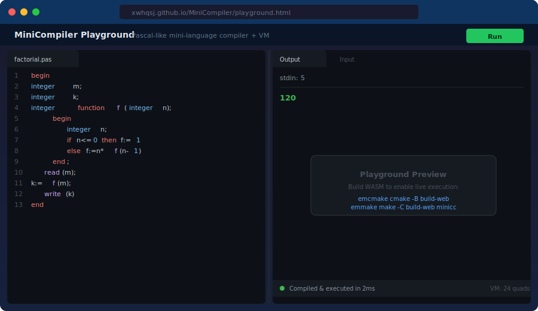

# MiniCompiler

[](https://github.com/XWHQSJ/MiniCompiler/actions/workflows/ci.yml)
[](https://github.com/XWHQSJ/MiniCompiler/releases)


A tiny compiler for a Pascal-like mini-language. Covers the full pipeline from lexical analysis through to execution on a stack-based virtual machine.

[Language spec](docs/language_spec.md) | [Examples](examples/README.md)

## How It Works

<p align="center">
  
</p>

The compiler implements a complete classical pipeline: source code is tokenized by the **lexer**, transformed into an AST by the **recursive-descent parser**, validated by the **semantic analyzer**, lowered to **three-address code** (quads), and executed by a **stack-based virtual machine**.

Each stage is self-contained under `src/` and can be inspected independently via CLI flags (`--tokens`, `--ast`, `--ir`, `--run`).

## Quick Start

```bash
cmake -S . -B build
cmake --build build

# Run the sieve of Eratosthenes
echo "20" | ./build/minicc examples/sieve.pas --run
# 2 3 5 7 11 13 17 19

# Compute 2^10
echo "2 10" | ./build/minicc examples/power.pas --run
# 1024
```

## Example Programs

<p align="center">
  
</p>

| Program | Description | Input | Output |
|---------|-------------|-------|--------|
| `factorial.pas` | Recursive n! | `5` | `120` |
| `sieve.pas` | Primes up to N | `20` | `2 3 5 7 11 13 17 19` |
| `sort.pas` | Sort 3 integers | `3 1 2` | `1 2 3` |
| `gcd.pas` | Euclidean GCD | `48 18` | `6` |
| `power.pas` | x^n | `2 10` | `1024` |

Real outputs captured from the compiler are stored in [`docs/`](docs/):
[sieve](docs/sample_output_sieve.txt) |
[factorial](docs/sample_output_factorial.txt) |
[sort](docs/sample_output_sort.txt) |
[gcd](docs/sample_output_gcd.txt) |
[power](docs/sample_output_power.txt)

See [examples/README.md](examples/README.md) for full input/output tables.

## AST Visualization

The compiler can emit the AST as XML (`--ast` or default mode). Below is the tree structure for `factorial.pas`:

<p align="center">
  
</p>

```bash
# Generate the XML AST yourself
./build/minicc examples/factorial.pas
```

The AST captures declarations, control flow, and expressions as a typed tree that the semantic analyzer validates before lowering to IR.

## Playground Preview

<p align="center">
  
</p>

**[Try it online](https://xwhqsj.github.io/MiniCompiler/playground.html)** -- the playground runs in demo mode with pre-computed outputs for the built-in examples. To run arbitrary programs locally with full WASM execution, see [docs/wasm-build.md](docs/wasm-build.md).

## Directory Layout

```
MiniCompiler/
├── src/
│   ├── lexer_pascal/     Pascal-like tokenizer (lex_pascal.h/.cpp)
│   ├── ast/              AST node types + XML/JSON printers
│   ├── symtable/         Scoped symbol table (push/pop)
│   ├── parser/           Recursive-descent parser -> AST
│   ├── ir/               Three-address IR generator + semantic analysis
│   ├── vm/               Stack-based virtual machine
│   └── driver/           Unified CLI entry point (main.cpp)
├── tests/                GoogleTest suites (lexer, parser, IR, VM, examples)
│   └── golden/           Golden-file test data
├── examples/             Sample programs (factorial, sieve, sort, gcd, power)
├── fuzz/                 libFuzzer targets for lexer and parser
├── docs/                 Language spec, WASM playground, build docs
├── .github/workflows/    CI, release binaries, gh-pages deployment
├── CMakeLists.txt        Top-level CMake build
└── README.md
```

## Build

Requires CMake 3.16+ and a C++17 compiler.

```bash
cmake -S . -B build
cmake --build build
```

## Run Tests

```bash
ctest --test-dir build --output-on-failure
```

44 tests cover: lexer (7), parser + golden file (7), semantic analysis + IR (6), VM end-to-end (9), example programs (15).

## CLI Usage

```bash
# Parse and print AST as XML (default)
./build/minicc examples/hello.pas

# JSON AST output
./build/minicc examples/hello.pas --json

# Show token stream
./build/minicc examples/hello.pas --tokens

# Dump three-address IR
./build/minicc examples/factorial.pas --ir

# Execute the program on the VM
echo "5" | ./build/minicc examples/factorial.pas --run
# => 120
```

## Language Features

- Integer arithmetic: `+`, `-`, `*`, `div`, `mod`
- Comparisons: `=`, `<>`, `<`, `<=`, `>`, `>=`
- Control flow: `if-then-else`, `while-do`, compound `begin-end` blocks
- Functions: single-parameter, recursive, integer return
- I/O: `read(x)`, `write(expr)`

See [docs/language_spec.md](docs/language_spec.md) for the full grammar and limitations.

## Fuzzing

Build fuzz targets with clang:

```bash
CC=clang CXX=clang++ cmake -S . -B build-fuzz -DENABLE_FUZZ=ON -DMINICC_BUILD_TESTS=OFF
cmake --build build-fuzz --target fuzz_lexer fuzz_parser
./build-fuzz/fuzz_lexer corpus/lexer
```

## VM Instruction Reference

| Op          | Description                          |
|-------------|--------------------------------------|
| LOAD_CONST  | dst = literal value                  |
| ASSIGN      | dst = src1                           |
| ADD/SUB/MUL/DIV/MOD | dst = src1 op src2            |
| LT/LE/GT/GE/EQ/NE | dst = (src1 cmp src2) ? 1 : 0 |
| JMP         | Unconditional jump to label          |
| JZ          | Jump to label if src1 == 0           |
| LABEL       | Named label marker                   |
| READ        | Read integer from stdin into dst     |
| WRITE       | Write dst to stdout                  |
| PARAM       | Push argument onto parameter stack   |
| CALL        | dst = call src1 with src2 args       |
| RET         | Return from function                 |
| FUNC_BEGIN  | Start of function body               |
| FUNC_END    | End of function body                 |

## Legacy Modules

The top-level directories `LexAnalyze/`, `PreCompiler/`, `Scanner/`, `Parser/`, and `Syntaxer/` are the original standalone modules. They are preserved for reference. The unified pipeline lives under `src/`.

## License

[MIT](LICENSE)
